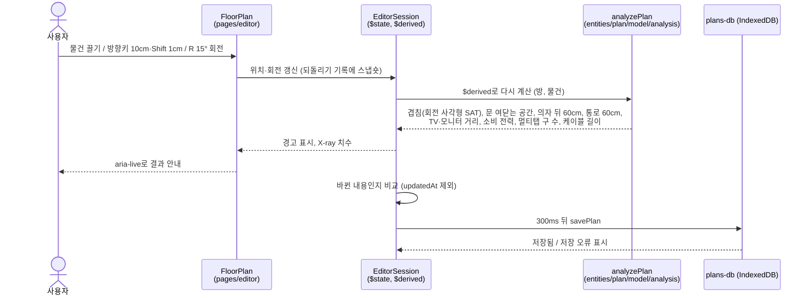
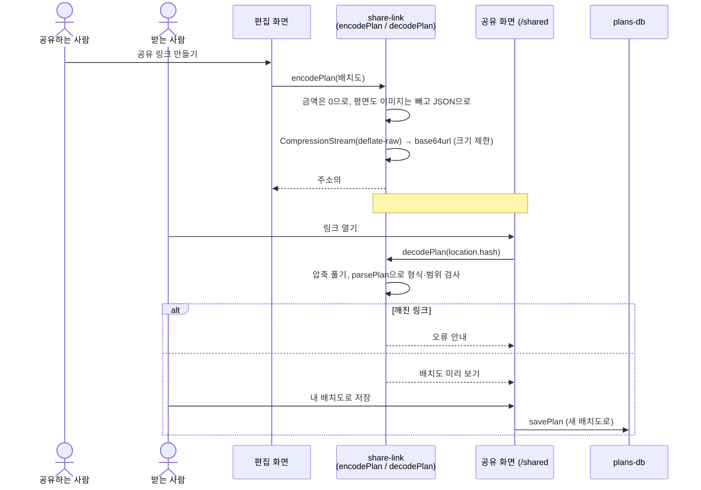
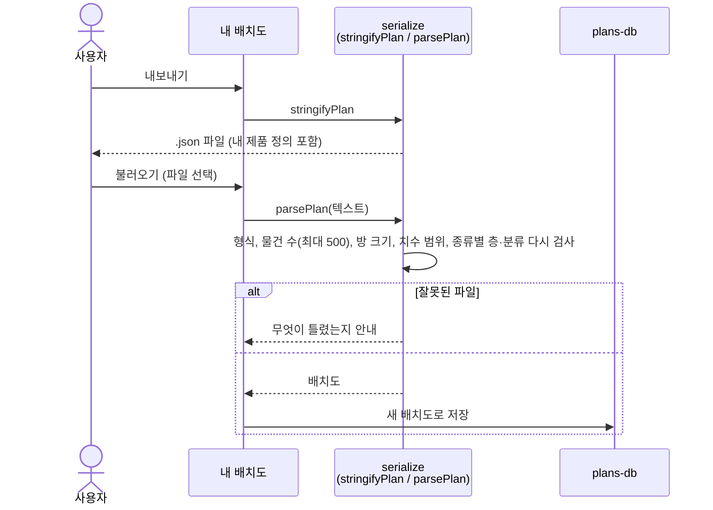

# 시퀀스 다이어그램

V는 서버 없이 브라우저에서만 동작합니다. 배치도는 IndexedDB에 저장하고, 점검은 상태가 바뀔 때마다 다시 계산합니다.

## 1. 물건 배치, 점검, 자동 저장

```mermaid
sequenceDiagram
    actor 사용자
    participant 도면 as FloorPlan<br/>(pages/editor)
    participant 세션 as EditorSession<br/>($state, $derived)
    participant 분석 as analyzePlan<br/>(entities/plan/model/analysis)
    participant 저장 as plans-db (IndexedDB)

    사용자->>도면: 물건 끌기 / 방향키 10cm·Shift 1cm / R 15° 회전
    도면->>세션: 위치·회전 갱신 (되돌리기 기록에 스냅숏)
    세션->>분석: $derived로 다시 계산 (방, 물건)
    분석-->>세션: 겹침(회전 사각형 SAT), 문 여닫는 공간, 의자 뒤 60cm, 통로 60cm,<br/>TV·모니터 거리, 소비 전력, 멀티탭 구 수, 케이블 길이
    세션-->>도면: 경고 표시, X-ray 치수
    도면-->>사용자: aria-live로 결과 안내
    세션->>세션: 바뀐 내용인지 비교 (updatedAt 제외)
    세션->>저장: 300ms 뒤 savePlan
    저장-->>세션: 저장됨 / 저장 오류 표시
```

## 2. 서버 없는 공유 링크

```mermaid
sequenceDiagram
    actor 공유하는 사람
    actor 받는 사람
    participant 편집 as 편집 화면
    participant 링크 as share-link<br/>(encodePlan / decodePlan)
    participant 공유 as 공유 화면 (/shared#…)
    participant 저장 as plans-db

    공유하는 사람->>편집: 공유 링크 만들기
    편집->>링크: encodePlan(배치도)
    링크->>링크: 금액은 0으로, 평면도 이미지는 빼고 JSON으로
    링크->>링크: CompressionStream(deflate-raw) → base64url (크기 제한)
    링크-->>편집: 주소의 # 뒤에 붙인 링크
    Note over 링크,공유: # 뒤는 서버로 전송되지 않음
    받는 사람->>공유: 링크 열기
    공유->>링크: decodePlan(location.hash)
    링크->>링크: 압축 풀기, parsePlan으로 형식·범위 검사
    alt 깨진 링크
        링크-->>공유: 오류 안내
    else
        링크-->>공유: 배치도 미리 보기
        받는 사람->>공유: 내 배치도로 저장
        공유->>저장: savePlan (새 배치도로)
    end
```

## 3. JSON 내보내기와 불러오기

```mermaid
sequenceDiagram
    actor 사용자
    participant 화면 as 내 배치도
    participant 직렬화 as serialize<br/>(stringifyPlan / parsePlan)
    participant 저장 as plans-db

    사용자->>화면: 내보내기
    화면->>직렬화: stringifyPlan
    직렬화-->>사용자: .json 파일 (내 제품 정의 포함)
    사용자->>화면: 불러오기 (파일 선택)
    화면->>직렬화: parsePlan(텍스트)
    직렬화->>직렬화: 형식, 물건 수(최대 500), 방 크기, 치수 범위, 종류별 층·분류 다시 검사
    alt 잘못된 파일
        직렬화-->>화면: 무엇이 틀렸는지 안내
    else
        직렬화-->>화면: 배치도
        화면->>저장: 새 배치도로 저장
    end
```
